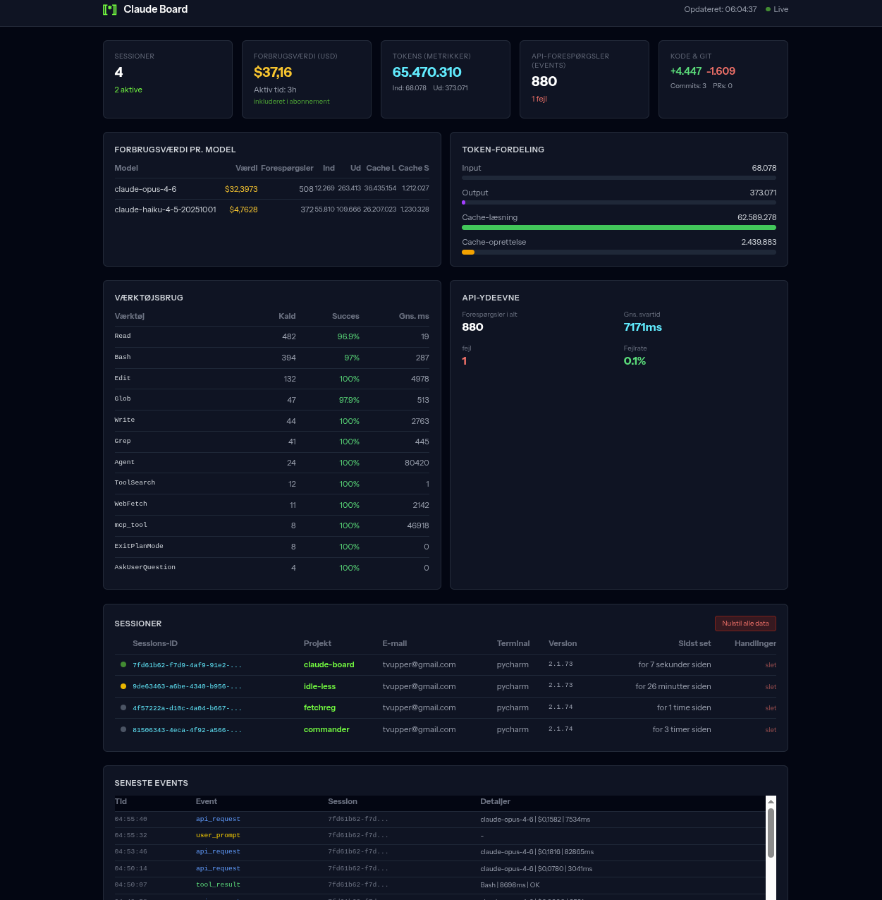
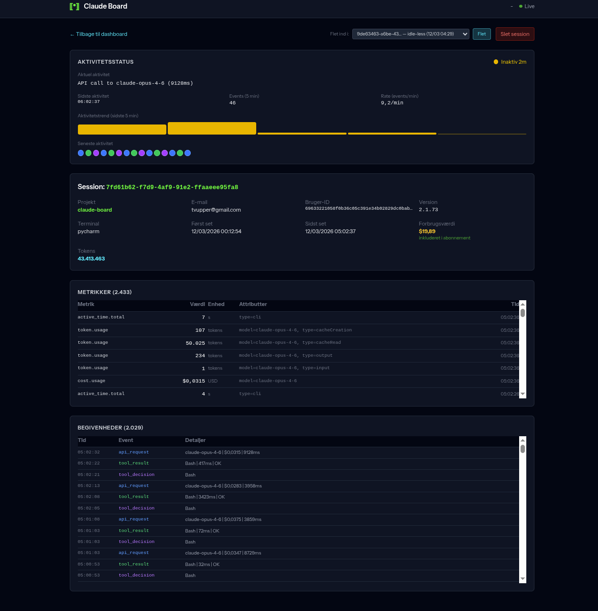
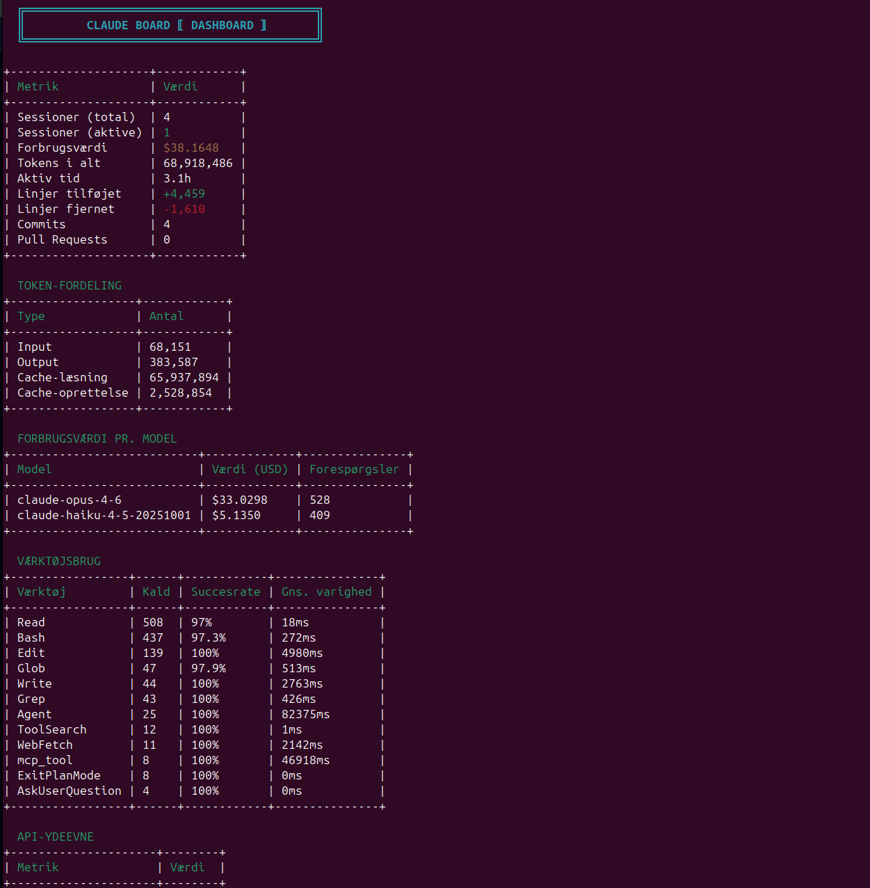

# Claude Board

Real-time telemetry dashboard for [Claude Code](https://docs.anthropic.com/en/docs/claude-code). Receives OpenTelemetry (OTLP) metrics and logs, stores them in SQLite, and displays session activity, token usage, cost estimates, tool performance, and more — via a web UI and a terminal CLI.

Built with Laravel 12, Tailwind CSS v4, and vanilla JavaScript. No frontend framework required.

<table>
<tr>
<td width="50%">
<strong>Web Dashboard</strong><br>

</td>
<td width="50%">
<strong>Session Detail</strong><br>

</td>
</tr>
<tr>
<td width="50%">
<strong>Terminal CLI</strong><br>

</td>
<td width="50%"></td>
</tr>
</table>

## Features

- **OTLP receiver** — Ingests metrics and logs from Claude Code via standard OpenTelemetry HTTP/JSON protocol
- **Live web dashboard** — Auto-refreshing (5s) dark-themed UI with session overview, cost breakdown, token analysis, tool usage, and event stream
- **Session detail view** — Per-session metrics, events timeline, activity status with real-time polling, and session merging
- **Terminal CLI** — Full dashboard in your terminal with `php artisan dashboard:show` (supports `--watch` for live updates)
- **Billing awareness** — Distinguishes subscription (flat-rate) vs. API (pay-per-use) billing, configurable globally or per-project via OTLP resource attributes
- **Multi-language** — English and Danish (easily extensible)
- **Locale-aware formatting** — Numbers, currency, dates, and relative times adapt to the configured locale

## Architecture

```
Claude Code  ──[OTLP http/json]──▶  POST /v1/metrics, /v1/logs (OtlpController)
                                              │
                                              ▼
                                          SQLite DB
                                              │
                                 ┌────────────┼────────────┐
                                 │                         │
                      DashboardController          DashboardShow (CLI)
                                 │                         │
                                 └──── shared query ───────┘
                                    DashboardQueryService
```

## Quick Start

### Requirements

- PHP 8.4+
- Composer
- Node.js 18+ and npm

### Installation

```bash
git clone https://github.com/tvup/claude-board.git
cd claude-board
composer setup
```

This runs `composer install`, copies `.env.example` to `.env`, generates an app key, runs migrations, and builds frontend assets.

### Start the Development Server

```bash
composer dev
```

Starts the PHP server on `:8080`, queue worker, log viewer, and Vite dev server on `:5173`.

Or start components individually:

```bash
php artisan serve --port=8080    # Web server
npm run dev                       # Vite (HMR for CSS/JS)
```

### Configure Claude Code to Send Telemetry

In the project where you use Claude Code, create or edit `.claude/settings.local.json`:

```json
{
  "env": {
    "CLAUDE_CODE_ENABLE_TELEMETRY": "1",
    "OTEL_METRICS_EXPORTER": "otlp",
    "OTEL_LOGS_EXPORTER": "otlp",
    "OTEL_EXPORTER_OTLP_PROTOCOL": "http/json",
    "OTEL_EXPORTER_OTLP_ENDPOINT": "http://localhost:8080",
    "OTEL_METRIC_EXPORT_INTERVAL": "10000",
    "OTEL_RESOURCE_ATTRIBUTES": "project.name=my-project,billing.model=subscription"
  }
}
```

| Attribute | Description |
|-----------|-------------|
| `project.name` | Label shown in the dashboard for this project |
| `billing.model` | `subscription` (default) or `api` — controls how cost figures are labeled |

Open [http://localhost:8080](http://localhost:8080) and start a Claude Code session — data will appear within seconds.

## CLI Dashboard

```bash
php artisan dashboard:show                        # Summary dashboard
php artisan dashboard:show --watch                # Live mode (5s refresh)
php artisan dashboard:show --session=<ID>         # Session detail
php artisan dashboard:show --delete=<ID>          # Delete a session
php artisan dashboard:show --merge=<SOURCE>:<TARGET>  # Merge sessions
php artisan dashboard:show --reset                # Reset all data
```

## Configuration

### Environment Variables

| Variable | Default | Description |
|----------|---------|-------------|
| `APP_LOCALE` | `en` | UI language: `en` or `da` |
| `CLAUDE_BILLING_MODEL` | `subscription` | Global billing mode: `subscription` or `api` |
| `APP_PORT` | `8080` | PHP server port |
| `VITE_PORT` | `5173` | Vite dev server port |

### Per-Project Billing Model

The billing model can be set per project via the `billing.model` OTLP resource attribute. Per-session values override the global `CLAUDE_BILLING_MODEL` setting. This allows mixing subscription and API projects in the same dashboard.

## API Endpoints

### OTLP Ingestion

| Method | Endpoint | Description |
|--------|----------|-------------|
| `POST` | `/v1/metrics` | OTLP metrics ingestion |
| `POST` | `/v1/logs` | OTLP logs ingestion |

### Dashboard

| Method | Endpoint | Description |
|--------|----------|-------------|
| `GET` | `/` | Web dashboard |
| `GET` | `/api/dashboard-data` | JSON polling endpoint |
| `GET` | `/sessions/{id}` | Session detail |
| `GET` | `/api/sessions/{id}/activity` | Session activity JSON |
| `DELETE` | `/sessions/{id}` | Delete session |
| `POST` | `/sessions/{id}/merge` | Merge sessions |
| `DELETE` | `/reset` | Reset all data |

## Tech Stack

- **Backend:** PHP 8.4+, Laravel 12
- **Database:** SQLite
- **Frontend:** Tailwind CSS v4, Vite 7, vanilla JavaScript
- **Protocol:** OpenTelemetry HTTP/JSON (OTLP)

## Adding a Language

1. Copy `lang/en/dashboard.php` to `lang/{locale}/dashboard.php`
2. Translate all values
3. Set `APP_LOCALE={locale}` in `.env`

See [CONTRIBUTING.md](CONTRIBUTING.md) for details.

## Security

Claude Board is designed as a **local development tool** with no built-in authentication. Do not expose it to the public internet without adding your own auth layer. See [SECURITY.md](SECURITY.md) for details and vulnerability reporting.

## Disclaimer

This project is not affiliated with, endorsed by, or officially connected to [Anthropic](https://www.anthropic.com/). "Claude" and "Claude Code" are trademarks of Anthropic, PBC. [OpenTelemetry](https://opentelemetry.io/) is a [CNCF](https://www.cncf.io/) project. This application simply implements the standard OTLP receiver protocol to display telemetry data that Claude Code can optionally emit.

## Built With

This project was designed and built collaboratively by [Torben](mailto:contact@torbenit.dk) and [Claude Code](https://docs.anthropic.com/en/docs/claude-code) (Anthropic's AI coding agent). The vast majority of the code — architecture, OTLP parsing, dashboard UI, CLI, security hardening, tests, and documentation — was authored by Claude Code under Torben's direction and review.

## Contributing

Contributions are welcome! See [CONTRIBUTING.md](CONTRIBUTING.md) for guidelines.

## License

MIT License. See [LICENSE](LICENSE) for the full text.

Copyright (c) 2026 [Torben IT ApS](mailto:contact@torbenit.dk) (CVR 39630605)
